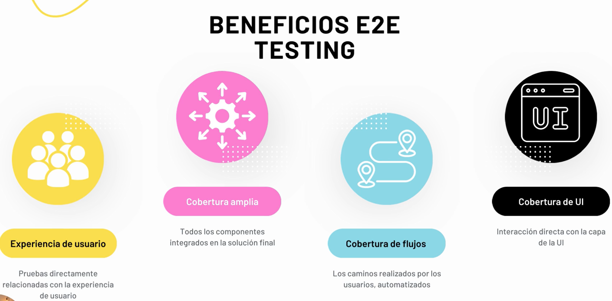
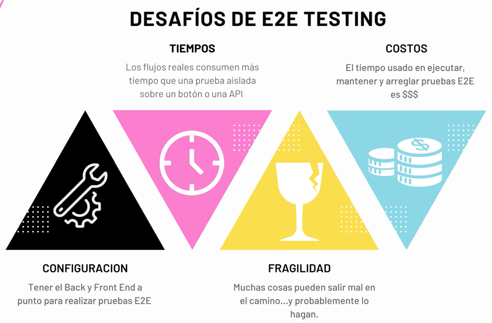

# 2E2 Testing con Playwright

Hay herramientas que permiten probar de principio a fin los flujos de usuarios de manera rápida y robusta (por ejemplo, un login, checkout de un carrito, etc). **Playwright** permite testear todo en uno, desde la UX hasta la capa de integracion sin necesidad de herramientas externas.

### Beneficios

### Desafíos

